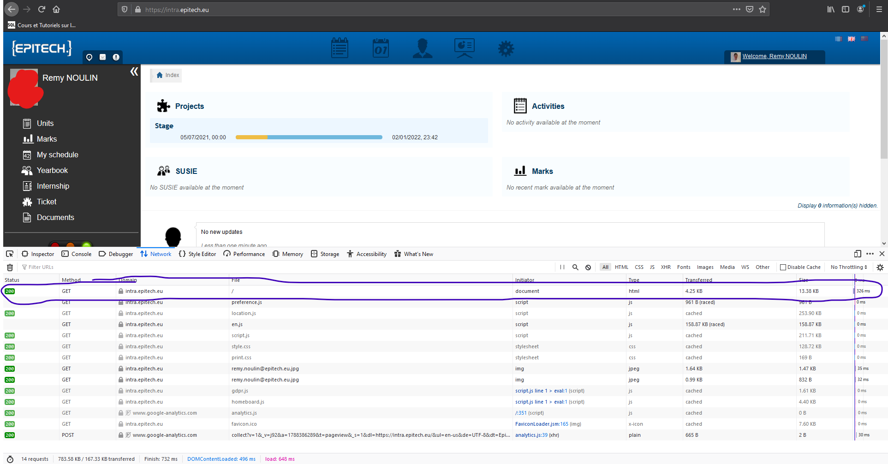
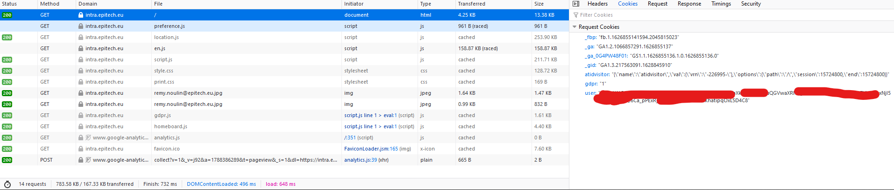

# EpiWrap

This is a wrapper for the epitech intranet 'api'

**installation**
````python
pip install epiwrap 
````

You can see here some examples:

````python
from epiwrap import intra

client = intra.EpiWrap(token="your token" or autolog="autolog link")

user = client.get_profile()

print("Name: " + user.fullname + "\nCredits: " + str(user.credits))
````

Go check the [wiki](https://github.com/Waz0x/EpiWrap/wiki) for more informations

## How to get your token ?
(token are limited in time but not autolog link so it's better to use autolog)

You must be connected to the [intranet](https://intra.epitech.eu/)

Now with the network tool (firefox "ctrl + shift + e", chrome "ctrl + shift + i" and then go in the network tab)
Click on the `/` request  
  
Now go on the `cookies tab` and copy your user token (it should look like this)  
  
Now you have your token, (don't forget that the cookie resets, so you have to change it when it's reset. Unfortunately I can't do anything to correct this)
