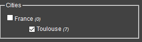
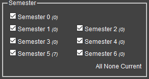
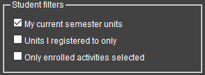

# PLANNING

url to get json content

````
https://intra.epitech.eu/intra/planning/load?format=json
````

You can add 2 parameters start and end date like this:
````
https://intra.epitech.eu/planning/load?format=json&start=start-date&end=end-date

format of date: 
    - year-month-day
````

You can send a payload in the request to add more parameters, this should look like this: 
````json
{
  "planning": "key=planning&value=%7B%22location%22%3A%22FR%2FTLS%22%2C%22semester%22%3A%220%7C1%7C2%7C3%7C4%7C5%7C6%22%2C%22student%22%3A%221%7C1%7C0%22%7D"
}
````
this payload mean this :
````
key=planning&value={"location":"FR/TLS","semester":"0|1|2|3|4|5|6","student":"1|1|0"}
````

where location refer to this:  


semester refer to this:  


and student this:  
  
**where 1 means it's unchecked and 0 checked (logik)**
